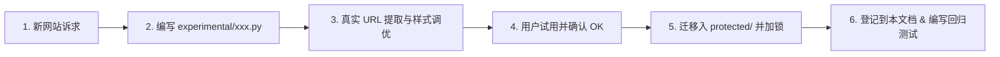

# 网站图片解析规则库与保护规范文档 (Image Parsing Rules & Protection Registry)

> **文档版本**：v1.0  
> **生效时间**：2026-09-21  
> **管理规范**：本规范定义了无限画布便签系统中各网站链接封面头图、标题及元数据的解析规则。  
> **保护机制**：凡标记为 🔒 **已锁定 (Protected)** 的规则已进入代码保护库（`backend/services/scrapers/protected/`），**未经用户明确指令，任何 AI 助手或后续重构严禁擅自修改其核心解析逻辑与代码**。

---

## 一、 保护库管理守则 (Protection Protocol)

1. **准入规则（OK 确认制）**：
   - 所有新网站或调整中的解析规则必须在 `experimental/`（试验库）中开发；
   - 必须经过真实网页测试（包括封面完整度、比例、反爬防御与标题准确性）；
   - **仅当用户明确回复“OK”或“可以”确认后**，方可由开发者/AI 迁移入 `protected/`（保护库）并在此文档登记为锁定状态。
2. **冻结原则（严禁擅自修改）**：
   - 处于 `protected/` 目录下的规则视为“冻结资产”；
   - 面对通用优化、整体重构、依赖升级等场景时，**严禁修改保护库文件**；
   - 如需变更保护库规则，必须由用户发出明确、具体的指令（如：“修改 B 站解析规则……”）。
3. **自动化测试守卫**：
   - 每个保护库规则必须在 `backend/tests/test_protected_scrapers.py` 中拥有基准测试（Gold Tests）；
   - 任何改动若导致保护库规则测试失败，均视为严重回退（Regression），必须立即回滚。

---

## 二、 规则全景总表 (Registry Overview)

| 规则编号 | 目标平台 | 适用域名 | 规则状态 | 用户确认(OK) | 核心解析策略 | 头图来源与品质 |
| :--- | :--- | :--- | :---: | :---: | :--- | :--- |
| **P-001** | **Bilibili (哔哩哔哩)** | `bilibili.com`, `b23.tv` | 🔒 **已锁定** | 2026-09-20 (OK) | 官方公开 API (`/x/web-interface/view`, `/masterpiece`) | 提取 `pic` 字段，去除协议头前缀，最高清原图 |
| **P-002** | **Instagram** | `instagram.com`, `instagr.am` | 🔒 **已锁定** | 2026-09-21 (OK) | 服务端 Embed 预渲染机制 (`/embed/captioned/`) + 独立纯净 UA | 提取 `EmbeddedMediaImage` 原图，100% 原始构图比例 |
| **P-003** | **YouTube** | `youtube.com`, `youtu.be` | 🔒 **已锁定** | 2026-09-21 (OK) | 视频 ID 路由匹配 + 官方 oEmbed API + maxresdefault | 1280x720 16:9 全高清官方缩略图 |
| **P-004** | **Pinterest** | `pinterest.com`, `pin.it` | 🔒 **已锁定** | 2026-09-21 (OK) | OpenGraph 协议解析 + `/originals/` 原始画质升频 | 探测并获取未压缩原始原图，100% 构图比例 |
| **E-001** | **飞书 (Feishu / Lark)** | `feishu.cn`, `larksuite.com` | ⏳ **试验区** | 暂时不行 (待突破) | 路径模式路由识别 + 鉴权拦截 + 紧凑文档卡片降级 | 待后续浏览器扩展或专属免密登录态突破私密头图 |
| **E-002** | **X / Twitter** | `x.com`, `twitter.com` | ⏳ **试验区** | 待用户确认 | FxTwitter 开放元数据接口 + Twitterbot SSR 直扫回退 | 提取原生 Mosaic 拼图/多图/视频缩略图/作者头像，标题格式化为“作者: “推文摘要”” |
| **G-001** | **通用网页兜底** | 全网其他公网 HTTP(S) 链接 | 🌐 **动态演进** | 持续生效 | OpenGraph 协议 ➔ Twitter Cards ➔ Headless 视口截图 | 提取 `og:image`；无图时自动调用 Chrome 无头视口截图 |

---

## 三、 受保护规则详细技术档案 (Protected Rules Specification)

### 🔒 规则 P-001: 哔哩哔哩 (Bilibili)
- **保护文件**：[`backend/services/scrapers/protected/bilibili.py`](file:///c:/Users/lalala/Desktop/note/backend/services/scrapers/protected/bilibili.py)
- **适用场景**：
  - B 站视频链接（含 `BV...` 或 `av...`）
  - B 站短链（`b23.tv/...` 自动追踪 302 重定向解析）
  - UP 主个人空间主页（`space.bilibili.com/{mid}`）
- **核心逻辑**：
  1. 提取视频 `BV号` / `av号`，调用官方高稳定性公开 API：`https://api.bilibili.com/x/web-interface/view?bvid=...`；
  2. 提取个人空间 `mid`，调用代表作公开接口：`https://api.bilibili.com/x/space/masterpiece?vmid=...`；
  3. 请求头携带 `Referer: https://www.bilibili.com`，绕过防盗链；
  4. 头图 URL 补全 `https:` 协议头，毫秒级获取原生高清封面。

---

### 🔒 规则 P-002: Instagram
- **保护文件**：[`backend/services/scrapers/protected/instagram.py`](file:///c:/Users/lalala/Desktop/note/backend/services/scrapers/protected/instagram.py)
- **适用场景**：
  - 帖子（`instagram.com/p/{shortcode}`）
  - Reels 短视频（`instagram.com/reel/{shortcode}`）
  - IGTV 视频（`instagram.com/tv/{shortcode}`）
  - 创作者公开主页（`instagram.com/{username}`）
- **核心逻辑**：
  1. 将帖子 URL 重写为官方 Embed 渲染终端：`https://www.instagram.com/p/{shortcode}/embed/captioned/`；
  2. **防封与规避空白核心**：使用纯净桌面 UA，坚决不发送 `Accept-Language: zh-CN`；
  3. 从 HTML 中精准提取 `class="EmbeddedMediaImage"` 的高清封面原图，并格式化作者与正文配文；
  4. 配合前端自适应宽高比，完美呈现 1:1、4:5 与 16:9 画幅。

---

### 🔒 规则 P-003: YouTube
- **保护文件**：[`backend/services/scrapers/protected/youtube.py`](file:///c:/Users/lalala/Desktop/note/backend/services/scrapers/protected/youtube.py)
- **适用场景**：
  - 视频链接（`youtube.com/watch?v={id}`）
  - 纯短链（`youtu.be/{id}`）
  - 短视频 Shorts（`youtube.com/shorts/{id}`）
- **核心逻辑**：
  1. 正则精确提取 11 位标准视频 ID；
  2. 优先请求 `https://i.ytimg.com/vi/{id}/maxresdefault.jpg`，获取 1280x720 超高清官方宽屏头图；若老视频无全高清图，自动回退到 `hqdefault.jpg`；
  3. 通过官方公开 `https://www.youtube.com/oembed` 接口秒级拉取视频标题与 UP 主频道名称；
  4. 自动匹配 YouTube 官方 Favicon 图标。

---

### 🔒 规则 P-004: Pinterest
- **保护文件**：[`backend/services/scrapers/protected/pinterest.py`](file:///c:/Users/lalala/Desktop/note/backend/services/scrapers/protected/pinterest.py)
- **适用场景**：
  - 画板 Pin 详情（`pinterest.com/pin/{id}`、`*.pinterest.com/pin/...`、`pin.it/...`）
- **核心逻辑**：
  1. 自动探测并接入本地代理端口（如 7897, 7890）；
  2. 提取 OpenGraph 元数据，并启动**原图品质升频引擎**：将 CDN 缩略路径 `/736x/` 替换为 `/originals/` 并校验可达性，优先输出未被压缩的 100% 原始设计素材图；
  3. 卡片根据图片自然高宽比自适应拉伸高度，完美呈现 Pinterest 常见的修长瀑布流灵感图。

---

### ⏳ 试验区规则 E-001: 飞书 (Feishu / Lark)
- **试验文件**：[`backend/services/scrapers/experimental/feishu.py`](file:///c:/Users/lalala/Desktop/note/backend/services/scrapers/experimental/feishu.py)
- **当前状态**：暂时不行 (待后续登录鉴权与浏览器扩展方案突破)；
- **当前策略**：智能识别文档路径类型，严格拦截重定向避免截取登录二维码，在未授权登录状态下降级呈现紧凑型 ~90px 文档信息卡。

---

### ⏳ 试验区规则 E-002: X / Twitter
- **试验文件**：[`backend/services/scrapers/experimental/x_twitter.py`](file:///c:/Users/lalala/Desktop/note/backend/services/scrapers/experimental/x_twitter.py)
- **当前状态**：试验区孵化中（待用户试用并确认 OK 后转入锁定保护库）；
- **适用场景**：
  - 推文/状态帖子链接（`x.com/{user}/status/{id}`, `twitter.com/{user}/status/{id}`, `x.com/i/status/{id}`, `mobile.twitter.com/...`）
  - 用户主页（`x.com/{username}`）
- **核心逻辑**：
  1. 正则精确提取 `username` 与 `status_id`；
  2. 优先调用全球公用高速接口 `https://api.fxtwitter.com/{user}/status/{id}`，毫秒级提取完整推文正文、作者姓名/账号、高清媒体大图（Mosaic 拼图/原图/视频封面）与头像；
  3. 二级容灾：若 FxTwitter 超时或受阻，自动回退到 `Twitterbot/1.0` 专用 UA 直扫 SSR 预渲染元数据；
  4. **标题与内容智能组合**：
     - 将卡片标题由单一作者名优化为：`作者: “推文摘要内容”`（如 `jack: “just setting up my twttr”`）；
     - 完整推文内容存入卡片 `description`，支持画布内全文搜索与鼠标悬浮预览；
  5. **动效生命周期与时机**：
     - 在粘贴创建卡片的第一时间（`isParsing: true`）立即启动顶部旋转光环动效；
     - 元数据与头图就绪后自然退出动效并平滑呈现封面，彻底消除“解析完成后才闪烁转圈”的延迟 Bug。

---

## 四、 兜底与异常处理策略 (Fallback Strategy)

### 规则 G-001: 通用元数据与截图兜底
- **保护文件**：[`backend/services/scrapers/fallback.py`](file:///c:/Users/lalala/Desktop/note/backend/services/scrapers/fallback.py)
- **优先级**：当保护库与试验库均无匹配处理器时启用；
- **提取顺序**：
  1. HTML Meta 标签：`og:image` ➔ `twitter:image` ➔ `itemprop="image"`；
  2. 标题提取：`og:title` ➔ `twitter:title` ➔ `<title>`；
  3. 网站图标：`<link rel="icon">` ➔ `domain.com/favicon.ico`；
  4. **智能视口截屏兜底**：
     - 若页面未提供 `og:image`，且目标不是鉴权/登录页（自动检查 `login`, `signin`, `auth`, `passport` 等关键词），自动调用无头浏览器对首屏视口（1280x800）截图；
     - 自动探测本地网络代理端口（如 7897, 7890 等），确保海外合规网站能正常渲染出图；
     - 截图缓存至 `backend/data/screenshots/` 并返回静态路由路径。

---

## 五、 新规则扩展流程 (Incubation Workflow)

